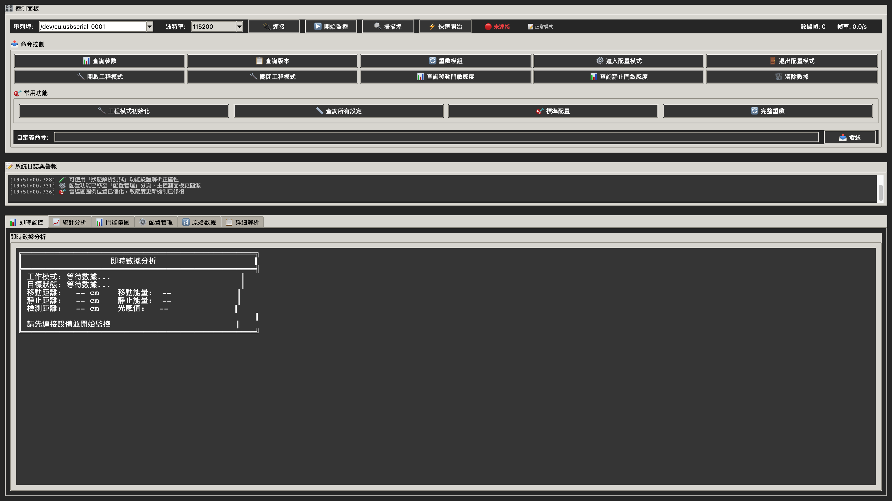
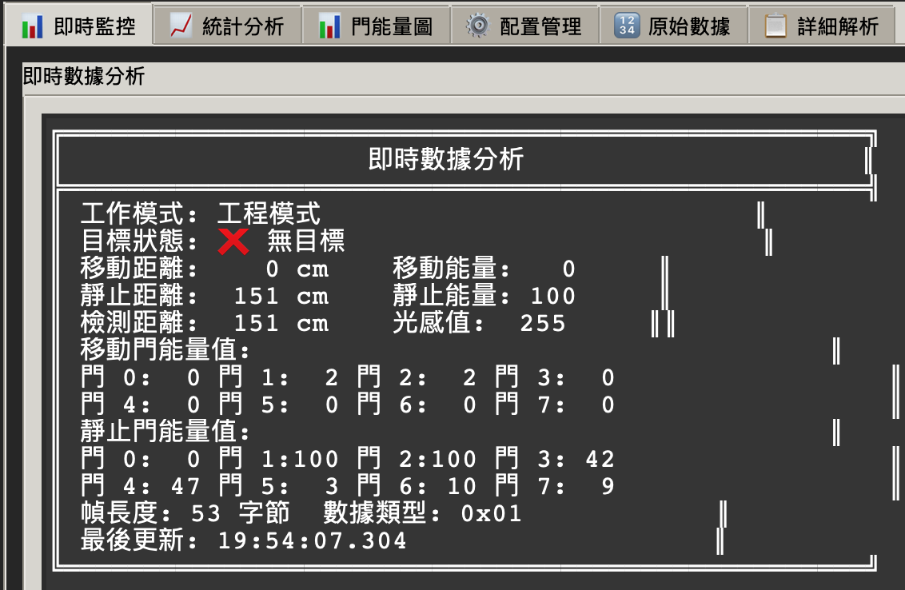
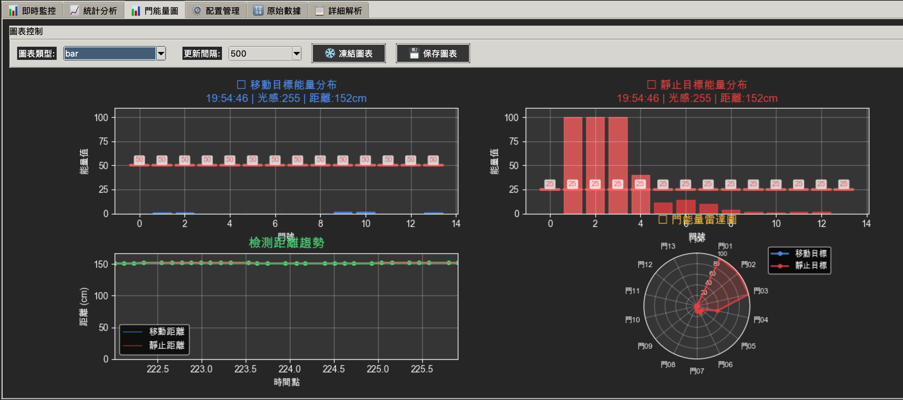

# LD2412 雷達傳感器深色主題 GUI 工具


一個功能完整的 LD2412 24GHz 毫米波雷達傳感器控制和數據分析工具，採用現代深色主題設計。

## 📸 界面展示

<!-- 添加應用程序截圖 -->

*主界面 - 深色主題設計*


*即時數據監控界面*


*門能量分布圖表*


*配置管理界面*

## ✨ 主要功能

### 🎨 現代化深色界面
- **護眼設計** - 專業的深色主題，長時間使用不疲勞
- **分頁式布局** - 即時監控、統計分析、圖表顯示、配置管理
- **響應式設計** - 適配不同屏幕尺寸

### 📊 實時數據監控
- **即時數據流** - 實時顯示目標狀態、距離、能量值
- **專業圖表** - matplotlib 驅動的門能量分布圖、雷達圖、趨勢圖
- **統計分析** - 檢測統計、幀率監控、距離範圍分析
- **工程模式** - 支援 14 門能量詳細分析

### ⚙️ 完整配置管理
- **參數配置** - 距離分辨率、波特率、敏感度設定
- **模式控制** - 工程模式/一般模式切換
- **進階功能** - 背景校正、光感輔助控制、藍牙管理
- **一鍵操作** - 標準配置、快速診斷、完整重啟

## 🚀 快速開始

### 環境需求
- Python 3.7 或更高版本
- macOS / Windows / Linux

### 安裝依賴
```bash
pip install -r requirements.txt
```

### 運行程序
```bash
python ld2412_dark_gui.py
```

## 📋 核心文件

- **`ld2412_dark_gui.py`** (159KB) - 深色主題 GUI 主程序
- **`LD2412串口通信協議說明.md`** (40KB) - 詳細協議文檔
- **`requirements.txt`** - Python 依賴列表
- **`LICENSE`** - MIT 開源許可證

## 🔧 功能特色

### 📊 數據分析
- 即時門能量分布圖表
- 雷達圖形化顯示
- 距離趨勢分析
- 統計報告生成

### ⚙️ 設備配置
- 距離分辨率設定 (0.75m / 0.5m / 0.2m)
- 波特率配置 (9600-460800)
- 藍牙控制
- 光感輔助控制

### 🎯 專業功能
- 工程模式 14 門詳細分析
- 動態背景校正
- 個別門敏感度設定
- 完整命令集支援

## 📖 使用說明

### 基本操作
1. 連接 LD2412 雷達模組到串列埠
2. 選擇正確的串列埠和波特率
3. 點擊「連接」建立通信
4. 點擊「開始監控」查看即時數據
5. 使用「快速開始」一鍵啟動監控

### 進階功能
- 使用「工程模式初始化」獲取詳細門能量數據
- 在「配置管理」分頁進行參數設定
- 查看「門能量圖」分析檢測範圍
- 使用「查詢所有設定」獲取完整設備狀態

## 🛠️ 技術規格

- **通信協議**: LD2412 官方協議
- **數據格式**: 16進制幀格式
- **更新頻率**: 最高 20Hz
- **檢測範圍**: 最大 12 米 (依分辨率而定)
- **門數量**: 14 個距離門

## 🔍 故障排除

### 常見問題
- **串列埠無法開啟**: 檢查設備連接和權限
- **無數據顯示**: 確認波特率設定正確
- **圖表不更新**: 檢查 matplotlib 安裝

### 技術支援
- 查看詳細的協議說明文檔
- 使用內建的診斷功能
- 檢查系統日誌和錯誤信息

## 📄 許可證

本項目採用 MIT 許可證 - 詳見 [LICENSE](LICENSE) 文件

## 🌟 Star History

[](https://star-history.com/#moneytom/LD2412-Tools&Date)

---

**作者**：moneytom  
**版本**：v2.6  
**最後更新**：2025年6月

> **注意**: 本工具專為 LD2412 雷達傳感器設計，確保您的設備韌體版本與協議文檔相符。
